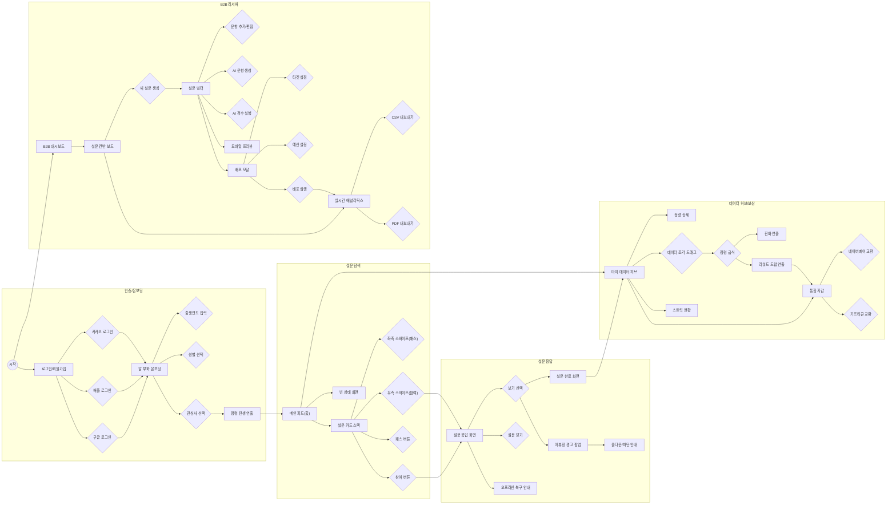

```mermaid
flowchart LR

  subgraph s1 ["인증/온보딩"]
    n1(("시작"))
    n2["로그인/회원가입"]
    n3{"카카오 로그인"}
    n4{"애플 로그인"}
    n5{"구글 로그인"}
    n6["알 부화 온보딩"]
    n7{"출생연도 입력"}
    n8{"성별 선택"}
    n9{"관심사 선택"}
    n10["정령 탄생 연출"]
  end

  subgraph s2 ["설문 탐색"]
    n11["메인 피드(홈)"]
    n12["설문 카드 스택"]
    n13{"우측 스와이프(참여)"}
    n14{"좌측 스와이프(패스)"}
    n15{"참여 버튼"}
    n16{"패스 버튼"}
    n17["빈 상태 화면"]
  end

  subgraph s3 ["설문 응답"]
    n18["설문 응답 화면"]
    n19{"보기 선택"}
    n20{"설문 닫기"}
    n21["어뷰징 경고 팝업"]
    n22["쿨다운/차단 안내"]
    n23["오프라인 복구 안내"]
    n24["설문 완료 화면"]
  end

  subgraph s4 ["데이터 허브/보상"]
    n25["마이 데이터 허브"]
    n26["정령 상세"]
    n27{"데이터 조각 드래그"}
    n28{"정령 급식"}
    n29["진화 연출"]
    n30["스트릭 현황"]
    n31["리워드 드랍 연출"]
    n32["통합 지갑"]
    n33{"네이버페이 교환"}
    n34{"기프티콘 교환"}
  end

  subgraph s5 ["B2B 리서처"]
    n35["B2B 대시보드"]
    n36["설문 칸반 보드"]
    n37{"새 설문 생성"}
    n38["설문 빌더"]
    n39{"문항 추가/편집"}
    n40{"AI 문항 생성"}
    n41{"AI 검수 실행"}
    n42["모바일 프리뷰"]
    n43["배포 모달"]
    n44{"타겟 설정"}
    n45{"예산 설정"}
    n46{"배포 실행"}
    n47["실시간 애널리틱스"]
    n48{"CSV 내보내기"}
    n49{"PDF 내보내기"}
  end

  n1 --> n2
  n2 --> n3
  n2 --> n4
  n2 --> n5
  n3 --> n6
  n4 --> n6
  n5 --> n6
  n6 --> n7
  n6 --> n8
  n6 --> n9
  n9 --> n10
  n10 --> n11
  n11 --> n12
  n12 --> n13
  n12 --> n14
  n12 --> n15
  n12 --> n16
  n11 --> n17
  n13 --> n18
  n15 --> n18
  n18 --> n19
  n18 --> n20
  n19 --> n21
  n21 --> n22
  n18 --> n23
  n19 --> n24
  n24 --> n25
  n11 --> n25
  n25 --> n26
  n25 --> n27
  n27 --> n28
  n28 --> n29
  n25 --> n30
  n28 --> n31
  n31 --> n32
  n25 --> n32
  n32 --> n33
  n32 --> n34
  n1 --> n35
  n35 --> n36
  n36 --> n37
  n37 --> n38
  n38 --> n39
  n38 --> n40
  n38 --> n41
  n38 --> n42
  n38 --> n43
  n43 --> n44
  n43 --> n45
  n43 --> n46
  n46 --> n47
  n36 --> n47
  n47 --> n48
  n47 --> n49
```
